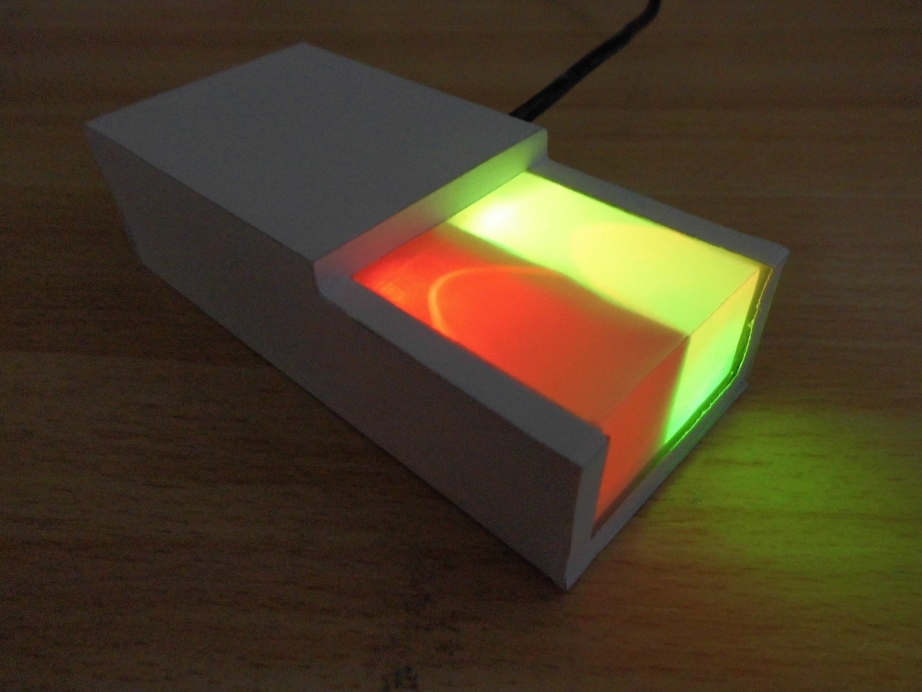
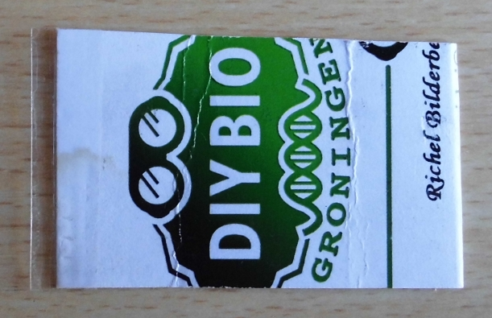
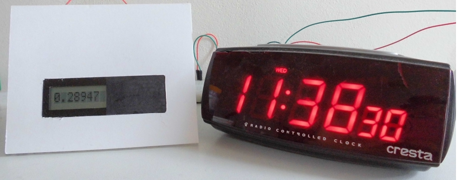
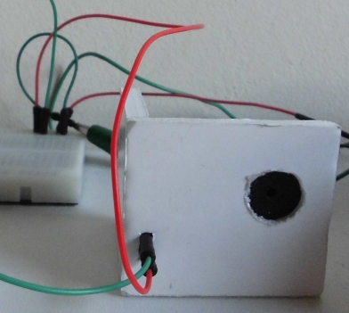
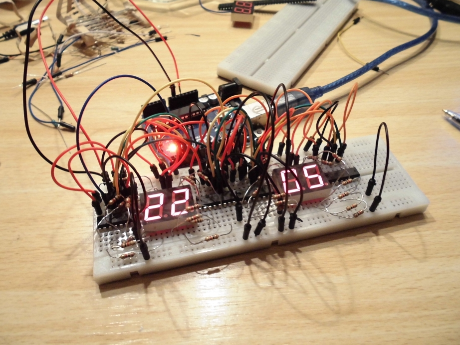
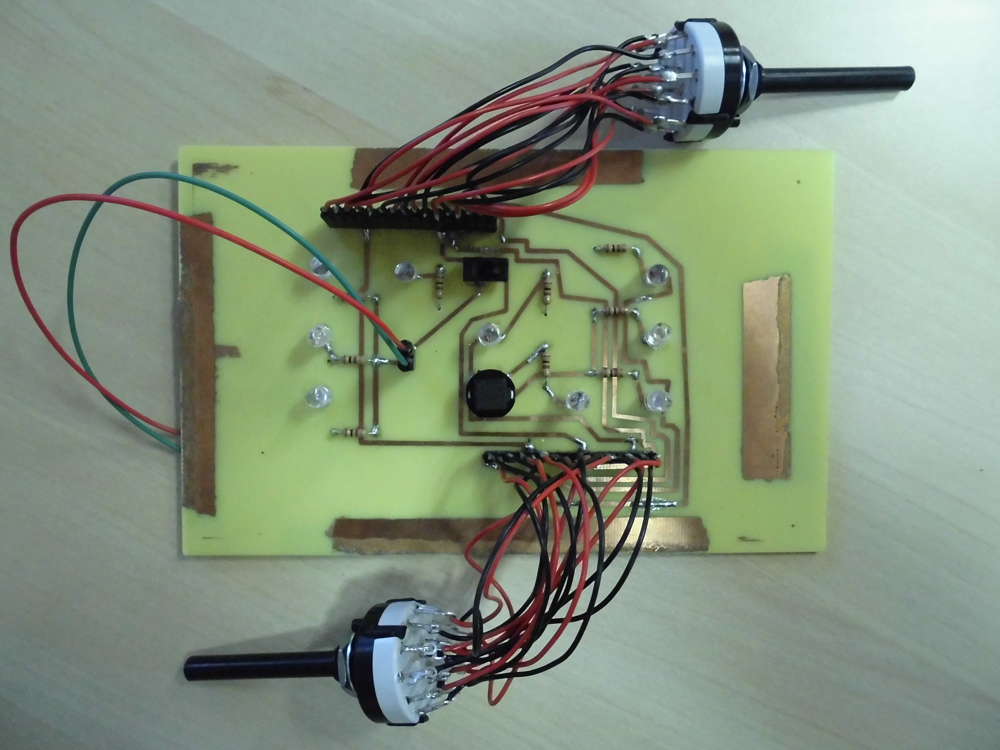
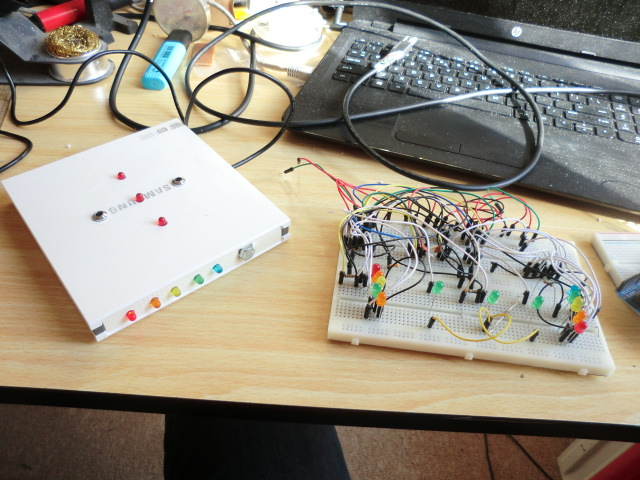
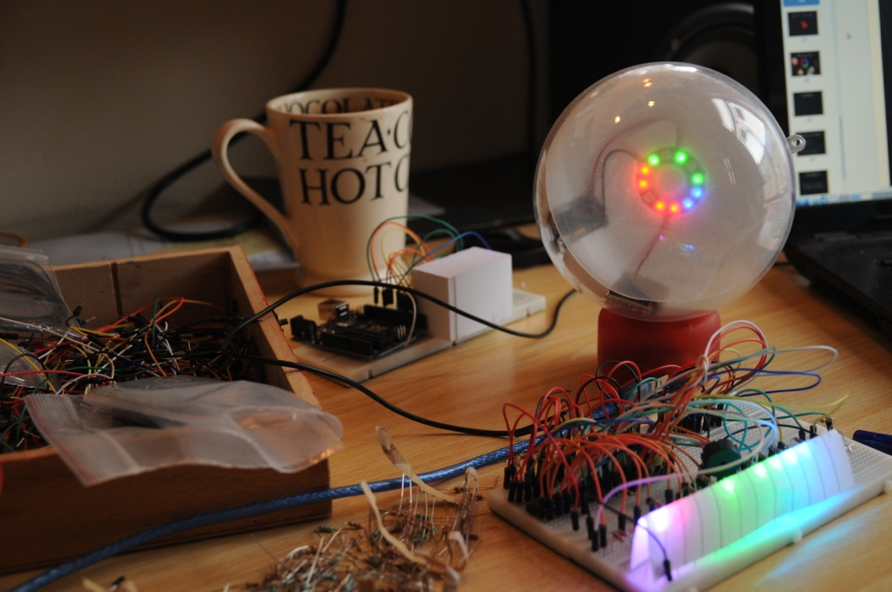

# machines

On this page you can find the machines I have made. All of these are
licensed under the CC-AT-SA license.

## Finished

### [ApproxyClock](https://github.com/richelbilderbeek/ApproxyClock)

A clock that you can approximately read the time of.

### [GeenEenTwee](https://github.com/richelbilderbeek/GeenEenTwee)

A machine that prevent pocket dialling.

### [IsClock](https://github.com/richelbilderbeek/IsClock)

A clock that tells what time it is in a mathematical sense.

### [MinimalPiClock](https://github.com/richelbilderbeek/MinimalPiClock)

A clock that beeps at 3:14 pm.

### [MoreOrLessClock](https://github.com/richelbilderbeek/MoreOrLessClock)

A clock that tells you more or less the correct time.

### [MysteryMachine](https://github.com/richelbilderbeek/MysteryMachine)

A mystery machine.

### [MysteryMachine2](https://github.com/richelbilderbeek/MysteryMachine2)

Another mystery machine.

### [NeoPixelPiClock](https://github.com/richelbilderbeek/NeoPixelPiClock)

A clock that beeps at 3:14 pm and shows the time in binary.

### [RgbLedPiClock](https://github.com/richelbilderbeek/RgbLedPiClock)

A clock that beeps at 3:14 pm and shows the time in binary.

## Unfinished

 * [Arduino TrialShields](https://github.com/richelbilderbeek/ArduinoTrialShields): Arduino shields with a puzzle that needs to be solved programmatically
 * [JamesBrown](https://github.com/richelbilderbeek/JamesBrown)
 * [Cmos4073BreakoutBoard](https://github.com/richelbilderbeek/Cmos4073BreakoutBoard)
